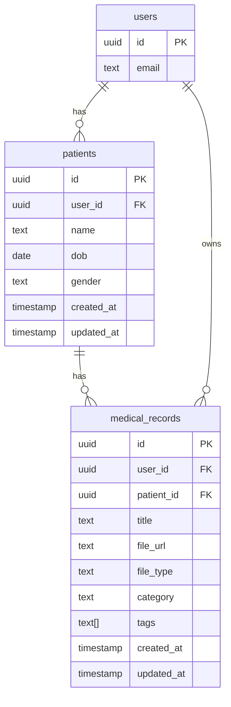
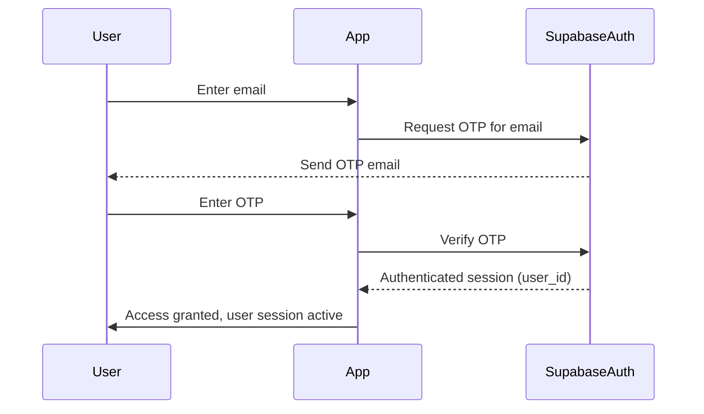

# Ayurlekha Architecture & Requirements

## 1. High-Level Overview
Ayurlekha is a multi-user, multi-patient medical records system. Each user logs in via email OTP (no password/signup required). Each user can manage multiple patients, and each patient can have multiple medical records. All data is strictly scoped to the authenticated user.

---

## 2. Entity Relationship Diagram

---

## 3. OTP Login Flow

### Flow Description
- User enters their email address.
- App requests Supabase to send an OTP to the email.
- User enters the OTP received in their email.
- App verifies the OTP with Supabase.
- If user exists, session is created. If not, Supabase creates the user.
- All subsequent data access is scoped to the authenticated user's ID.

### Mermaid Sequence Diagram

---

## 4. Storage Structure
- All uploaded documents are stored in Supabase Storage under:
  `/user_id/patient_id/filename`
- This ensures strict user and patient-level isolation.

---

## 5. Requirements Summary
- Email OTP login (no password/signup required)
- Each user can have multiple patients
- Each patient can have multiple medical records
- All data access and storage is user-scoped
- RLS (Row Level Security) enforced for all sensitive tables
- All queries must filter by authenticated user's ID
- Storage paths must reflect user and patient hierarchy

---

## 6. Future Enhancements
- Patient profile editing
- Record sharing (with explicit consent)
- Audit logs for access
- Soft deletion and recovery

---

*This document is a living architecture and requirements reference. Update with new diagrams and flows as the system evolves.* 

rm -rf .expo && rm -rf node_modules/.cache && npx expo install --fix
npx expo start --clear --web
npm install @supabase/supabase-js react-native-url-polyfill