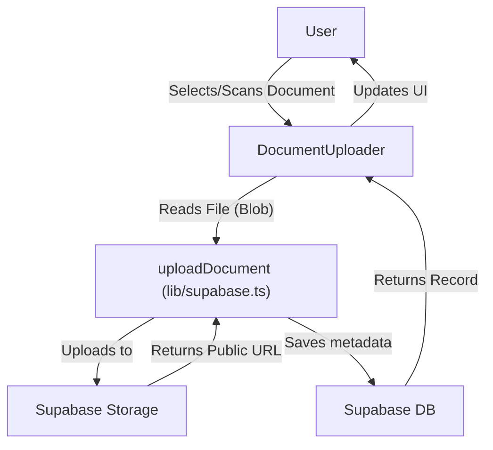
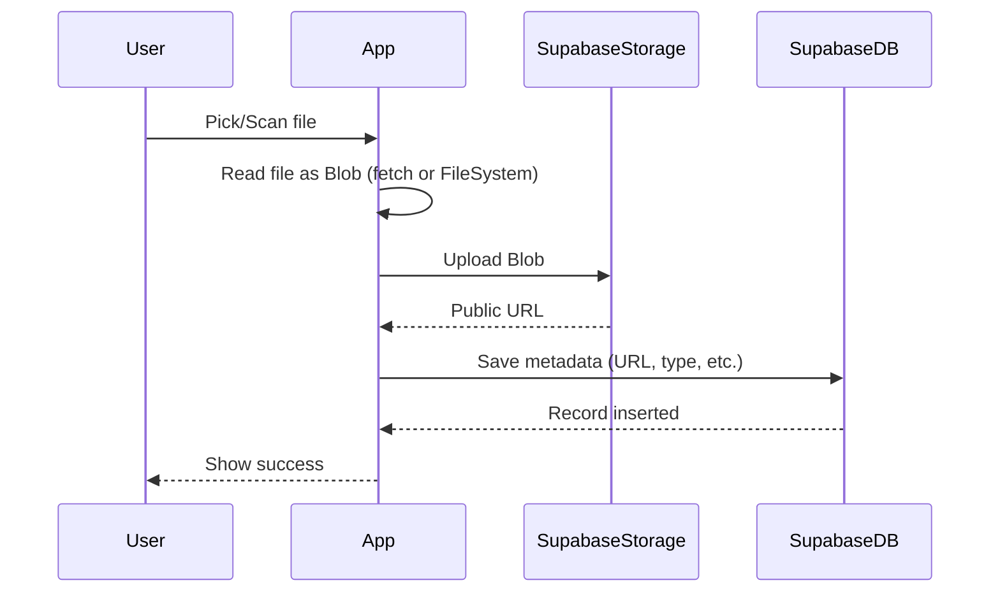
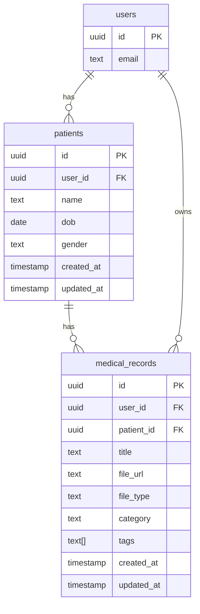

# Ayurlekha

A cross-platform (Expo/React Native) medical records app using Supabase for backend storage and authentication.

## Features
- Patient management
- Medical document upload (images, PDFs)
- Supabase Storage integration
- Modular, scalable architecture

## App Flow
1. User selects or scans a document (image or PDF).
2. App reads file (as binary/Blob).
3. App uploads file to Supabase Storage.
4. App saves metadata to Supabase Database.
5. User can view/download documents.

## Architecture Diagram


## Upload Logic (Detailed)


## Project Structure
```
project/
  app/                # App entry and navigation
    (tabs)/           # Main tab screens
    components/       # UI components (Uploader, Modals, etc.)
    hooks/            # Custom hooks
    lib/              # Supabase client and API logic
    stores/           # State management
    supabase/         # DB migrations
    assets/           # Images/icons
    types/            # TypeScript types
  package.json
  app.json
  tsconfig.json
```

## Environment
- Expo SDK 53+
- Supabase JS client
- Expo DocumentPicker, ImagePicker, FileSystem

## Setup
```bash
# Install dependencies
npm install

# Set up .env with Supabase keys
cp .env.example .env

# Start the app
npm run dev
```

## Patient Creation & Data Integrity
- All patients are created via Supabase (never client-generated IDs).
- Patient IDs and all record IDs are UUIDs (universally unique identifiers).
- If you see an error about invalid UUID, clear your local patient/record store and re-add patients via the app.
- Use the new `clearPatients` and `clearRecords` methods in the store for a clean slate during testing.

## Upload Flow (User-Patient-Document)
1. User logs in via email OTP (Supabase Auth).
2. User adds a patient (Supabase generates UUID, associates with user).
3. User uploads a document for a patient:
   - File is uploaded to Supabase Storage under `/user_id/patient_id/filename`.
   - Metadata is saved to `medical_records` with correct user_id and patient_id (both UUIDs).
4. User can view/download documents for their patients only.

## Troubleshooting
- **Invalid patientId or userId (UUID) error?**
  - Clear your local patient and record store (see above).
  - Re-add patients via the app (do not use old data or manually created IDs).
- **Upload fails after adding a patient?**
  - Ensure patient was created via the app and not with a client-generated ID.

## Current Issue & Fix
**Problem:** Files uploaded from mobile are corrupted (cannot be opened).

**Root Cause:** Expo’s fetch(file.uri).blob() does not always work for local files on native. Must use a method that guarantees a valid Blob.

**Solution:**
- Use expo-file-system to read the file as a binary, then convert to Blob for upload.
- For PDFs and non-images, avoid using fetch on file URIs.

**Example Fix:**
```js
import * as FileSystem from 'expo-file-system';

const fileUri = file.uri;
const fileData = await FileSystem.readAsStringAsync(fileUri, { encoding: FileSystem.EncodingType.Base64 });
const byteCharacters = atob(fileData);
const byteNumbers = new Array(byteCharacters.length);
for (let i = 0; i < byteCharacters.length; i++) {
  byteNumbers[i] = byteCharacters.charCodeAt(i);
}
const byteArray = new Uint8Array(byteNumbers);
const blob = new Blob([byteArray], { type: file.type });
```
Then upload this blob to Supabase.


